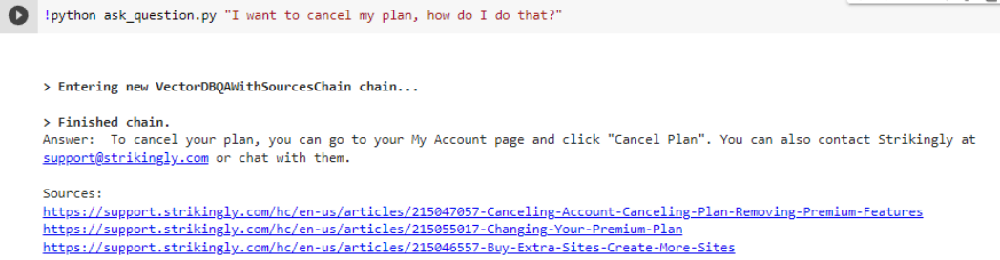
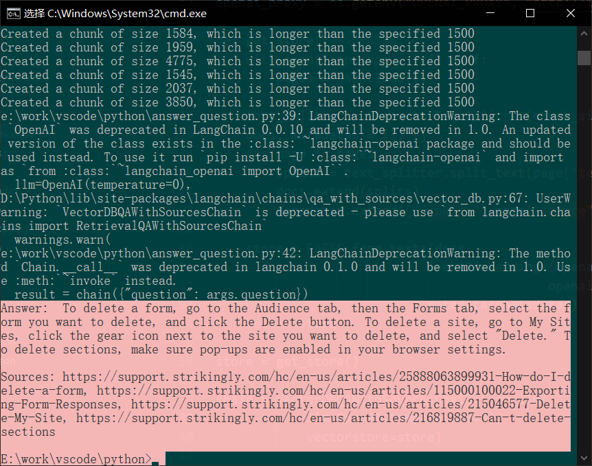
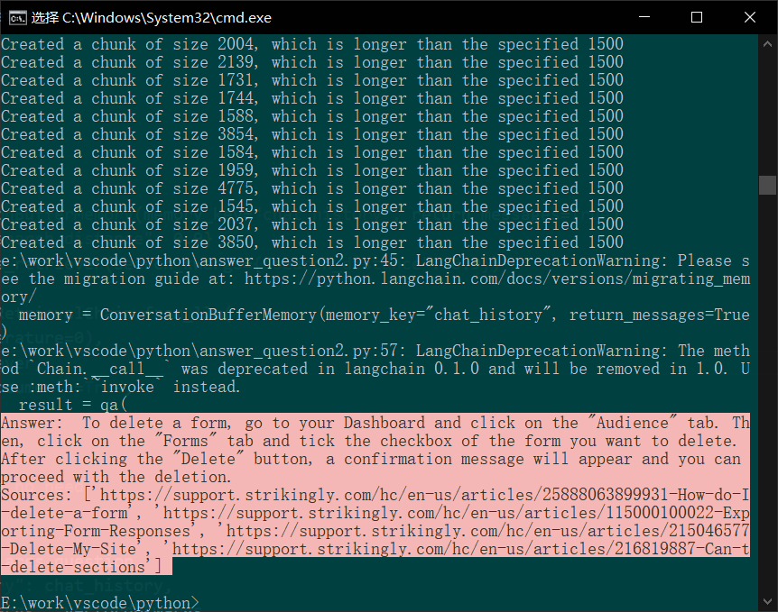

# py dev test - by wwnao

_范海宁_

## Task 1

In this task, you are required to follow this [blog](https://www.paepper.com/blog/posts/build-q-and-a-bot-of-your-website-using-langchain/) and its [source code](https://github.com/mpaepper/content-chatbot) to create a langchain chatbot. This chatbot should be able to answer questions about articles in the [Strikingly support center](https://support.strikingly.com/hc/en-us).

To do this:

- Instead of “Use the website’s sitemap.xml to query all URLs”, you need to use this zendesk api:
  https://support.strikingly.com/api/v2/help_center/en-us/articles.json
  to retrieve all the en-us support articles of Strikingly support center.
- Hint: You can use Postman workspace, or your own way, to visualize the response of the zendesk api and consider how to extract the desired information.
- Follow the tutorial in the blog to create the FAISS vectorstore for the content of the support articles. You should store the information in the same format as the “pages”. It should be a list of dictionaries, where the k,v pair should be:
  {“text”: text_of_support_article, “source”: url_of_the_article}
- After you get your “pages”, use the code below to create your vectorstore:
  
  (The code is from “create_embedding.py” file)
- Test it with “python ask_question.py [your question here]”, replace [your question here] with the actual question. Your answer should look like the image below:
  

## Task 2

In this task, you are required to make some changes in the chatbot you made in Task 1. The chatbot in the Task 1 uses VectorDBQAWithSourcesChain in answer_question.py, and ChatVectorDBChain in start_chat_app.py. What you need to do is to use ConversationalRetrievalChain in answer_question.py.
Task:

- The original requirements.txt has langchain==0.0.117 in it. Now you need to change it to langchain==0.0.158 and install it again.
- The answer_question.py file is a program that takes an argument, which is the question, and then answers that question. Your task is to implement the ConversationalRetrievalChain in answer_question.py so that the response looks more humanized.
- The default initializations of both ChatVectorDBChain and ConversationalRetrievalChain do not return the source documents. However, your implementation is required to return the url of the sources, like how the sources are shown in the answer of VectorDBQAWithSourcesChain in your first task. It should look like the image below:
  
  Hint:

- ConversationalRetrievalChainis the new version of ChatVectorDBChain. Their implementations into our task are similar. However, ChatVectorDBChain in start_chat_app.py uses a “while loop” to continue chatting with you. We do not need the chatbot to continue chatting.
- Pay attention to how the vectorstore is passed into the chain.
- We do not need the chat_history now but it is a required input_key for the chain. How to deal with it?
- Read this example of how to set up a chain using ConversationalRetrievalChain
- Read the source code of ConversationalRetrievalChain and the example above to check how to return the source documents.
- Pay attention to the format of returned documents. How should you get the urls?

Requirements

- You are required to implement it using Google Collab for easier sharing. Make sure to share the permission to access Collab notebook with dafeng@strikingly.com
- You need to provide your own OpenAI token
- You are required to finish the task within 48 hours and send to the Wechat group

# answer

## task1 answer

### 1.爬虫

poetry init 初始化项目

使用 httpx +xpath

查看网页的 url 示例

https://support.strikingly.com/hc/en-us/articles/25888063899931-How-do-I-delete-a-form

https://support.strikingly.com/hc/en-us/articles/12737217267995-Transferring-a-Register-com-domain-to-Strikingly

url 结构为

    https://support.strikingly.com/hc/en-us/articles/ + id + name

注意到给了所有网站的一个 json 集合，那就不需要自己爬了，直接用

发现 len(json["articles"]) = 30，说明不是全部文章
于是爬取后续文章列表
https://support.strikingly.com/api/v2/help_center/en-us/articles.json?page=2&per_page=30

修改 page 为 40, 50，都返回"next_page": null,
那么就知道如何结束了，因此基本可以确定爬虫程序。

发现有 clouadflare 盾，尝试 requests、httpx、selenium、playwright 无果
改用 cloudscraper

防止网络问题，边爬边保存，先持久化到 json 再说

```python
import json
from bs4 import BeautifulSoup
from naotool.httpn import AutoCloseAsyncClient
import asyncio
import cloudscraper

sc = cloudscraper.create_scraper()

# 最终目标，提取全文本
pages = []

async def get_a_article(url: str):
    # 访问网站
    await asyncio.sleep(3)
    html = sc.get(url).text
    soup = BeautifulSoup(html, "html.parser")
    text = soup.get_text()
    text = "\n".join((s.strip() for s in text.split("\n") if s.strip()))
    print(text)
    pages.append({"text":text, "source": url})
    with open("tmp.json", "w") as f:
        json.dump(pages, f)

async def main():
    next_url = "https://support.strikingly.com/api/v2/help_center/en-us/articles.json?page=1&per_page=30"
    while next_url:
        async with AutoCloseAsyncClient() as client:
            res = await client.get(next_url)
            json: dict = res.json()
            tasks = [
                get_a_article(article.get("html_url"))
                for article in json.get("articles")
            ]
             # 等待所有任务完成
            await asyncio.gather(*tasks)
            next_url = json.get("next_page")

asyncio.run(main())

```

### 2.构建

openai-api-key 刚好用光了，先买一个 key

无法序列化...那就构建完直接使用

```python
import json
import os
from langchain_text_splitters import CharacterTextSplitter
from langchain_community.vectorstores import FAISS
from langchain_openai import OpenAIEmbeddings
from langchain_community.llms import OpenAI
from langchain.chains import VectorDBQAWithSourcesChain
import argparse

parser = argparse.ArgumentParser(description='Paepper.com Q&A')
parser.add_argument('question', type=str, help='Your question for Paepper.com')
args = parser.parse_args()

# 从环境变量中获取 API 密钥
openai_api_key = os.getenv("OPENAI_API_KEY")
openai_proxy = os.getenv("OPENAI_PROXY", "http://127.0.0.1:7890")

def get_store():
    with open("tmp.json", "r") as f:
        pages = json.load(f)

    text_splitter = CharacterTextSplitter(chunk_size=1500, separator="\n")
    docs, metadatas = [], []
    for page in pages:
        splits = text_splitter.split_text(page["text"])
        docs.extend(splits)
        metadatas.extend([{"source": page["source"]}] * len(splits))

    store = FAISS.from_texts(docs,
                            OpenAIEmbeddings(openai_proxy=openai_proxy,
                                            openai_api_key=openai_api_key),
                            metadatas=metadatas)
    return store

store = get_store()
chain = VectorDBQAWithSourcesChain.from_llm(
            llm=OpenAI(temperature=0),
            vectorstore=store)
result = chain({"question": args.question})

print(f"Answer: {result['answer']}")
print(f"Sources: {result['sources']}")
```

### 3.成果展示：

```bash
D:/Python/python.exe e:/work/vscode/python/answer_question.py "How do I delete a form?"
```



## task2 answer

### 1.取出来 source

查看源码，发现

result['source_documents'] 是一个 List[Document]

```python
document = Document(
                page_content="Hello, world!",
                metadata={"source": "https://example.com"}
            )
```

所以要取出来 source 很简单了， 拿到 metadata 里面的 source 即可

```python
sources = [doc.metadata["source"] for doc in result["source_documents"]]
```

### 2.参数踩坑

再稍微注意一下传参的不同，这里也是报错几次才改好
关键是 retriever 的搜索距离传参方式，文档已经过时了

```python
vectordbkwargs = {"search_distance": 0.9}
retriever = store.as_retriever(search_kwargs={"search_distance": 0.9})
qa = ConversationalRetrievalChain.from_llm(
    llm=OpenAI(temperature=0),
    retriever=retriever,
    return_source_documents=True,
)

chat_history = []  # no need
result = qa(
    {
        "question": args.question,
        "chat_history": chat_history,
        "vectordbkwargs": vectordbkwargs,
    }
)
```

### 成果展示：

最后也是如愿以偿，虽然中间报错很多，
版本迁移的痛点啊

```bash
D:/Python/python.exe e:/work/vscode/python/answer_question.py "How do I delete a form?"
```



## src

最后附上完整代码

```python
import json
from bs4 import BeautifulSoup
from naotool.httpn import AutoCloseAsyncClient
import asyncio
import cloudscraper

sc = cloudscraper.create_scraper()


# 最终目标，提取全文本

with open("tmp.json", "r") as f:
    pages = json.load(fp=f)

async def get_a_article(url: str):
    # 访问网站
    await asyncio.sleep(3)
    html = sc.get(url).text
    soup = BeautifulSoup(html, "html.parser")
    text = soup.get_text()
    text = "\n".join((s.strip() for s in text.split("\n") if s.strip()))
    print(text)
    pages.append({"text":text, "source": url})
    with open("tmp.json", "w") as f:
        json.dump(pages, f)

async def main():
    next_url = "https://support.strikingly.com/api/v2/help_center/en-us/articles.json?page=1&per_page=30"
    while next_url:
        async with AutoCloseAsyncClient() as client:
            res = await client.get(next_url)
            json: dict = res.json()
            tasks = [
                get_a_article(article.get("html_url"))
                for article in json.get("articles")
            ]
             # 等待所有任务完成
            await asyncio.gather(*tasks)
            next_url = json.get("next_page")

asyncio.run(main())

```

```python
# filename：answer_question.py
import json
import os
from langchain_text_splitters import CharacterTextSplitter
from langchain_community.vectorstores import FAISS
from langchain_openai import OpenAIEmbeddings

from langchain_community.llms import OpenAI
from langchain.chains import VectorDBQAWithSourcesChain
import argparse

parser = argparse.ArgumentParser(description='Paepper.com Q&A')
parser.add_argument('question', type=str, help='Your question for Paepper.com')
args = parser.parse_args()

# 从环境变量中获取 API 密钥
openai_api_key = os.getenv("OPENAI_API_KEY")
openai_proxy = os.getenv("OPENAI_PROXY", "http://127.0.0.1:7890")

def get_store():
    with open("tmp.json", "r") as f:
        pages = json.load(f)

    text_splitter = CharacterTextSplitter(chunk_size=1500, separator="\n")
    docs, metadatas = [], []
    for page in pages:
        splits = text_splitter.split_text(page["text"])
        docs.extend(splits)
        metadatas.extend([{"source": page["source"]}] * len(splits))

    store = FAISS.from_texts(docs,
                            OpenAIEmbeddings(
                              openai_proxy=openai_proxy,
                              openai_api_key=openai_api_key),
                            metadatas=metadatas)
    return store
store = get_store()
chain = VectorDBQAWithSourcesChain.from_llm(
            llm=OpenAI(temperature=0),
            vectorstore=store)
result = chain({"question": args.question})

print(f"Answer: {result['answer']}")
print(f"Sources: {result['sources']}")
```
